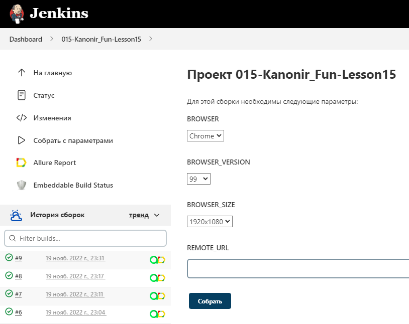
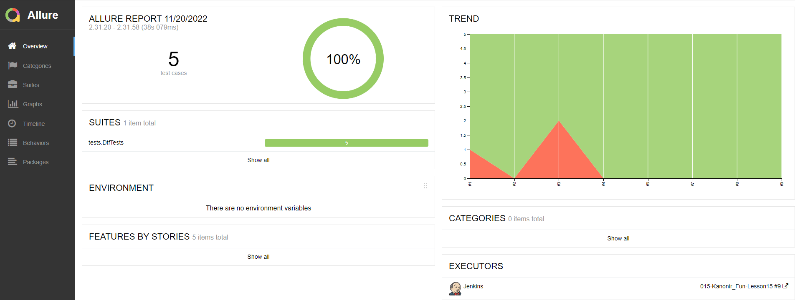
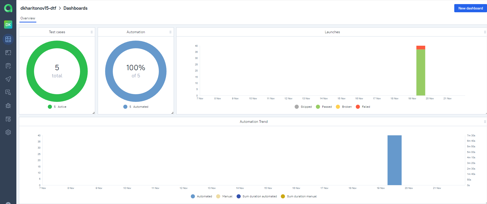
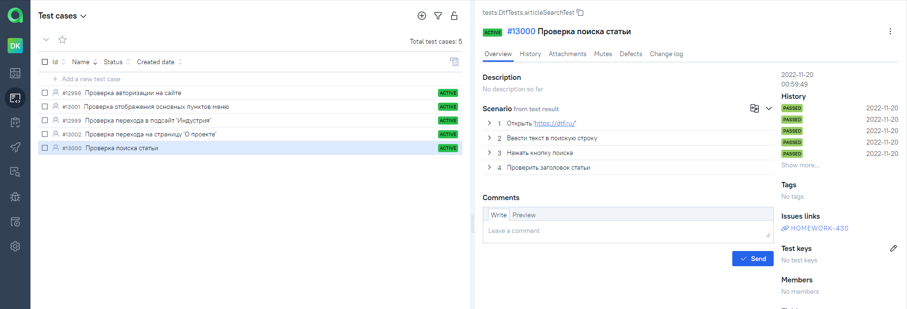
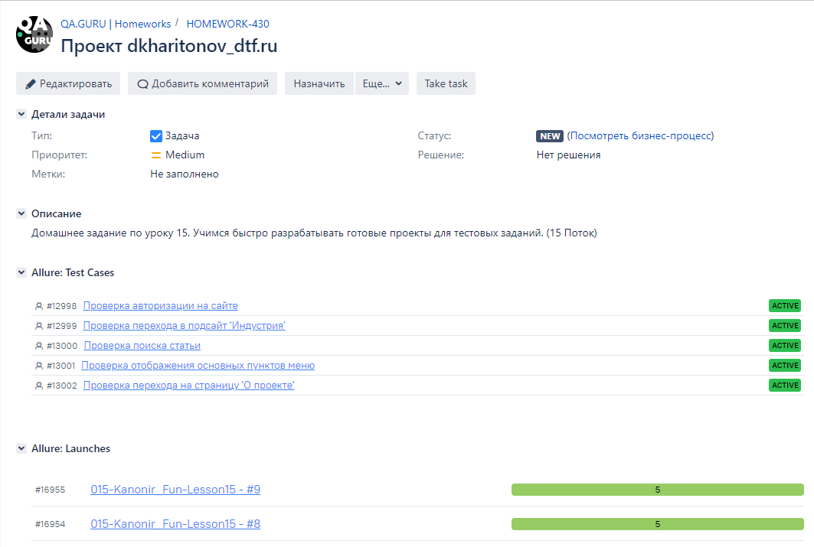
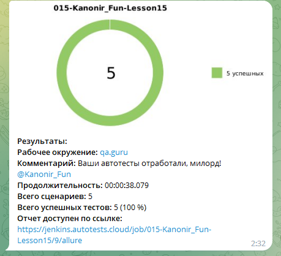

# Проект по автоматизации тестирования сайта dtf.ru
<p  align="center">


##	Содержание

- [Технологии и инструменты](#technologist-технологии-и-инструменты)
- [Реализованы проверки](#bookmark_tabs-реализованные-проверки)
- [Запуск тестов из терминала](#computer-запуск-тестов-из-терминала)
- [Запуск тестов в Jenkins](#-запуск-тестов-в-jenkins)
- [Отчет о результатах тестирования в Allure Report](#-отчет-о-результатах-тестирования-в-Allure-report)
- [Интеграция с Allure TestOps](#-интеграция-с-allure-testops)
- [Интеграция с Jira](#-интеграция-с-jira)
- [Уведомления в Telegram с использованием бота](#-уведомления-в-telegram-с-использованием-бота)
- [Пример запуска теста в Selenoid](#-пример-запуска-теста-в-selenoid)


## :computer: Технологии и инструменты

<p  align="center">

<code></code>
<code></code>
<code></code>
<code></code>
<code></code>
<code></code>
<code></code>
<code></code>
<code></code>
<code></code>
<code></code>
<code></code>
</p>


## :bookmark_tabs: Реализованные проверки:
### UI Tests

- Проверка отображения основных пунктов меню 
- Проверка перехода в подсайт 'Индустрия' 
- Проверка перехода на страницу 'О проекте'
- Проверка поиска статьи
- Проверка авторизации на сайте

## :computer: Запуск тестов из терминала

### Локальный запуск тестов

```bash
gradle clean test
```

### Удаленный запуск тестов

```bash
gradle clean test
-Dbrowser=${browser}
-DbrowserVersion=${browserVersion}
-DbrowserSize=${browserSize}
-DremoteUrl=${remoteUrl}
```

## Параметры сборки

 <code>browser</code> – браузер, в котором будут выполняться тесты (_по умолчанию - <code>chrome</code>_).

 <code>browserVersion</code> – версия браузера (_по умолчанию - <code>106</code>_).

 <code>browserSize</code> – размер окна браузера, в котором будут выполняться тесты (_по умолчанию - <code>1920x1080</code>_).

 <code>remoteUrl</code> – логин, пароль и адрес удаленного сервера Selenoid (_по умолчанию указаны в сборке Jenkins_).

##  Запуск тестов в [Jenkins](https://jenkins.autotests.cloud/job/015-Kanonir_Fun-Lesson15/)

Для запуска сборки необходимо указать значения параметров и нажать кнопку <code><strong>*Собрать*</strong></code>.

<p align="center">
  
</p>

##  Отчет о результатах тестирования в [Allure Report](https://jenkins.autotests.cloud/job/015-Kanonir_Fun-Lesson15/9/allure/)

<p align="center">
  
</p>

##  Интеграция с [Allure TestOps](https://allure.autotests.cloud/project/1688/dashboards)

## Основной дашборд

<p align="center">
  
</p>
 
## Тест-кейсы 

<p align="center">
  
</p>

##  Интеграция с [Jira](https://jira.autotests.cloud/browse/HOMEWORK-430)

<p align="center">
  
</p>

##  Уведомления в Telegram с использованием бота
После завершения сборки специальный бот, созданный в <code>Telegram</code>, автоматически обрабатывает и отправляет сообщение с отчетом о прогоне тестов.

<p align="center">

</p>

##  Пример запуска теста в Selenoid

К каждому тесту в отчете прилагается видео.

<p align="center">
  
</p>